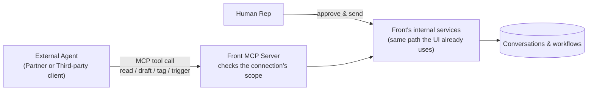

**Related:** [Opportunity brief](01-opportunity-brief.md), [event model](03-event-model.md)

This follows the brief's own three parts: Problem Formulation, Solution Definition,
Technical Implications.

## Assumptions

Written from outside Front, using its public MCP developer documentation
(dev.frontapp.com/docs/mcp-server) and the brief, not internal access. The OAuth
model, scopes, and rate limits cited throughout are documented publicly, not guessed
at. Genuinely unknown from outside: the real volume behind the brief's "growing
priority," whether an identity fix is already planned internally, and the extent of
Front's internal activity logging beyond what's public.

# Part 1: Problem Formulation

## Abstract

Front's Developer Platform is opening up to external AI agents, customer-built
copilots, partner integrations, third-party agent frameworks, that read Front context
and take action through Front's existing MCP server. That server has real OAuth and
scopes, but no identity for the agent itself: every connection borrows a specific
teammate's exact permissions. That's a permissions problem for the customer, a
fragility problem for the partner, and a portability problem for the third-party
client. This PRD proposes a first-class agent connection: an admin-granted principal
with its own scopes, its own audit trail, and one-click revocation, with the send step
held back for a human in every case. It starts narrow, read and draft only, and earns
the case for autonomy later with real usage data.

## Problem statement

Front's MCP server already supports OAuth 2.1 with real read, write, and send scopes
enforced at the tool level, but every connection authenticates as a specific Front
teammate and inherits that person's exact permissions. There's no identity for the
agent itself, only the identity of whoever authorized it: an admin can't grant an
agent narrower access than that person already has, can't manage it as its own object,
and any activity record shows the authorizing teammate rather than the agent. As a
result, access drifts with the authorizing teammate's role and breaks if they leave;
security and compliance can't assess or revoke an agent's access without touching a
human's own OAuth grant; and every customer asking to connect an agent today either
accepts that coupling or waits.

## Personas

| Role | Pain | Success state |
|---|---|---|
| Customer (e.g. Instructure) | Can only give an agent access by having it borrow a teammate's identity and exact permissions | Grants an agent its own scoped, named connection; sees what it did; revokes it without engineering help |
| Partner (e.g. Aircall) | Its integration's access ceiling still depends on which teammate authorized it | Builds once against a stable scope model a customer's admin grants directly |
| Third-party client (e.g. Claude Desktop) | Needs the same access pattern everywhere it's pointed; today's model can't give it that | Connects the same way regardless of which customer's admin grants access |

"Admin" and "Support rep" below are roles a Customer's teammates play; "External
agent" is the calling client (copilot, partner integration, or third-party client) —
Front's system can't tell the three apart at the protocol level, only by which
connection grant it holds.

## Use cases

Ranked by leverage: impact on rep throughput/response time vs. risk and effort to ship
safely.

| Rank | Use case | Leverage | Notes |
|---|---|---|---|
| 1 | UC-01: Agent drafts a reply | Highest | High impact, low risk — human still gates every send |
| 2 | UC-02: Agent reads conversation context | High | Enabler for every other use case; no write, minimal trust required |
| 3 | UC-03: Agent triages a conversation | Medium-high | Compounds at volume; mistakes are recoverable |
| 4 | UC-04: Agent triggers a defined workflow | Medium | Narrower applicability; a real action with consequences |

- **UC-01** Agent calls `draft_reply` (needs `draft_reply` scope) → draft is created in
  "drafted" status, visible to the assigned rep; never sent.
- **UC-02** Agent calls `get_conversation` (needs `read_conversations` scope) → returns
  context, no state change; denied and logged if scope missing or connection revoked.
- **UC-03** Agent calls `apply_tags` (needs `apply_tags` scope) → tag/routing applied
  and logged; denied, no partial application, if scope or tag is invalid.
- **UC-04** Agent calls `trigger_workflow` for one pre-approved workflow ID (needs a
  scope naming that exact ID) → Front's existing workflow engine runs it as if a human
  had; any other workflow ID is denied.

**Supporting use cases** (prerequisites and governance, not independently ranked):
UC-05 admin creates a connection with chosen scopes; UC-06 rep reviews a draft and
issues the send themselves (never the agent); UC-07 admin revokes a connection,
denying all subsequent calls immediately; UC-08 admin reviews the audit log, filterable
by connection.

The [event model](03-event-model.md) diagrams UC-01, UC-02, and UC-05–UC-08 in full;
UC-03/UC-04 follow the identical command/event/read-model pattern and aren't
separately diagrammed.

# Part 2: Solution Definition

## MVP vs. roadmap

**MVP**: agent connection as its own principal, MCP tools gated by connection scope
(read, draft, tag, trigger), a human-gated send, an audit log, one-click revocation.

**Beyond GA:** v1.1 opt-in autonomous send for pre-approved tags/macros, earning trust
incrementally; v2 a directory of vetted partner agents plus per-agent analytics; v2+
expand workflow-trigger from pre-defined workflows to agent-created automation rules.

## Release phases

| Phase | Duration | Scope | Key risk |
|---|---|---|---|
| P0 | 4-6 wks | Scope taxonomy, agent-connection data model, security/infra design doc | Security review stalls timeline — loop in legal/compliance from day one |
| P1 | 8-10 wks | Connection UI, audit log, 3 MCP tools (read conversation/contact, draft reply); closed beta, 5-10 design partners | Reps ignore drafts — measure edit-distance/send-rate from day one |
| P2 | 6-8 wks | Tag/assign and workflow-trigger tools; open beta, self-serve connections | Overly broad scope grants — default to team/inbox level, rate-limit writes |
| P3 (GA) | n/a | Decide v1.1 autonomous-send opt-in from beta data | Pressure to fast-follow before trust is earned — gate on measured signals, not a date |

**Dependencies:** security/compliance sign-off on the agent-as-sub-processor question
(High risk); Front's core authorization service supporting a new principal type (High);
legal review of developer attestation terms (Medium); the existing workflow engine
(Medium); design partners for closed beta (Low).

## Out of scope and non-goals

Deferred (each has a real trigger to revisit): autonomous send (until draft accept-rate
and edit-distance prove out through Phase 2); a partner marketplace/directory (until
demand is validated post-GA); a dedicated agent SLA (until usage volume justifies one);
SDKs beyond raw MCP calls (until adoption data shows tooling, not trust, is the
blocker); multi-workspace connection management (until a multi-workspace customer asks).

Not deferred, ruled out entirely — each would undermine the safety model itself:
self-expanding scopes; an agent modifying its own permission grant; cross-workspace or
cross-tenant access; any non-MCP transport.

## Success metrics

| Metric | Target | By when |
|---|---|---|
| Adoption | 30% of API-plan workspaces create ≥1 agent connection | 90 days post-GA |
| Time to first integration | Median under 30 min, credentials to first sandbox call | End of Phase 1 beta |
| Developer satisfaction | 8/10+ on scope-model clarity (post-beta survey) | End of Phase 1 beta |
| Reliability | 99.9% MCP availability; P95 tool-call latency under 500ms | GA |

# Part 3: Technical Implications

## How Front and external systems communicate

MCP is the transport between Front and any external agent. The agent (or its hosting
framework) calls typed tools mapping directly to the scoped permission model in Part
1; the MCP server checks the connection's scope, then hands the call to the same
internal services Front's UI already uses — no second execution path.

Both paths end at the same internal services, but only the rep's path can produce a
send — the structural guarantee behind the human-in-the-loop claim in Part 1.

## Functional requirements

- **FR-01 Create a scoped agent connection:** admin names a connection and picks
  scopes from a fixed list; system creates it "active" with exactly those scopes.
- **FR-02 Enforce scope at every tool call:** a call outside the connection's granted
  scopes is denied and logged, with no partial effect.
- **FR-03 Draft-only tool for agents:** the reply tool only ever produces a draft
  (`ReplyDrafted` event); no agent path can send to a customer.
- **FR-04 Human-issued send command:** only a rep's `SendReply` produces a `ReplySent`
  event; no connection identity can appear as its sender.
- **FR-05 Audit every scoped action:** each successful scoped call writes one audit
  entry with connection, action, target, and timestamp.
- **FR-06 One-click revocation:** revoking a connection sets it "revoked" immediately;
  any later call from it is denied.
- **FR-07 Scoped triage tool:** a connection with `apply_tags` can tag/route a
  conversation within scope, logged.
- **FR-08 Scoped workflow-trigger tool:** a connection scoped to one workflow ID can
  trigger it through Front's existing engine; any other ID is denied.

## Non-functional requirements

- **Latency:** P95 under 500ms (read), under 800ms (write: draft/tag/trigger).
- **Availability:** 99.9%, Front's standard API SLA; no dedicated agent SLA in v1.
- **Throughput:** per-connection rate limits aligned to existing MCP limits (~120/min
  light reads, 30/min heavy reads, 20/min writes), not pooled across a workspace.
- **Error rate:** under 0.1% internal errors on well-formed calls; 100% of
  out-of-scope calls denied — zero tolerance for scope escapes.
- **Security:** short-lived credentials via token exchange; every scope check is
  server-side; revocation takes effect in under one minute end to end.
- **Compliance:** audit entries retained ≥1 year; developers attest to data-handling
  terms at connection time.

## Trade-offs to work through with engineering

1. **Coupling vs. a dedicated gateway** — binding tools directly to internal APIs
   ships faster but risks breaking a public contract on refactor; a versioned gateway
   is safer but slower.
2. **Sync vs. async tool calls** — MCP favors synchronous request/response, but a
   multi-minute workflow trigger needs polling or a long-held connection.
3. **Fine-grained vs. bundled scopes** — least-privilege thinking favors fine-grained
   scopes; admins find bundles easier to reason about at grant time.
4. **Per-connection vs. per-workspace rate limits** — per-connection is predictable for
   a developer; per-workspace protects infrastructure better but obscures why one
   agent's calls get throttled by another's.

## Assumptions and constraints

**Hardest assumption:** that human-in-the-loop draft approval is enough to de-risk
launch, and customers won't push to skip it. If they do, the permission/audit layer
is already robust enough that v1.1 becomes a scope-and-policy change, not a
re-architecture.

Other assumptions: admins manage connections without added tooling beyond this PRD's
UI; existing customer DPAs can accommodate an agent under an attestation, not a full
renegotiation.

Constraints: must build on Front's existing MCP OAuth infrastructure, not replace it;
writes go through the existing internal command/event pipeline, no second execution
path; MCP's own auth patterns are still stabilizing industry-wide, limiting how much
can be locked in now versus versioned later.
