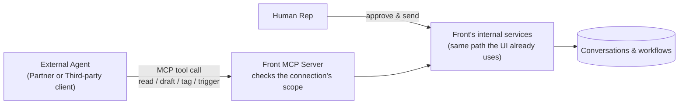

**Related:** [Opportunity brief](01-opportunity-brief.md), [event model](03-event-model.md)

This follows the brief's own three parts: Problem Formulation, Solution Definition,
Technical Implications.

# Part 1: Problem Formulation

## Abstract

Front's Developer Platform is opening up to external AI agents, the brief's own terms
are "customer-built copilots, partner integrations, third-party agent frameworks",
that read Front context and take action through the MCP server Front already
shipped. That server already has real OAuth and scopes, but no identity for the agent
itself: every connection borrows a specific teammate's exact permissions. That's a
permissions problem for the Customer, a fragility problem for the Partner, and a
portability problem for the Third-party client. This PRD proposes a first-class agent
connection: an admin-granted principal with its own scopes, its own audit trail, and
one-click revocation, with the send step held back for a human in every case. It
starts narrow, read and draft only, and earns the case for autonomy later with real
usage data.

## Assumptions

Written from outside Front, using its public MCP developer documentation
(dev.frontapp.com/docs/mcp-server) and this brief, not internal access. The OAuth
model, scopes, and rate limits cited throughout are documented publicly, not guessed
at. What's genuinely unknown from outside:

- The actual volume and mix of customer, partner, and third-party-client requests
  behind the brief's "growing priority."
- Whether an agent-identity fix is already planned or in flight internally.
- The audit log this PRD proposes is a new, agent-specific enrichment on top of
  whatever Front already has; I don't know the extent of Front's existing internal
  activity logging beyond what's public.

## Problem statement

**Current state.** Front's MCP server already supports OAuth 2.1 access with real
read, write, and send scopes enforced at the tool level. Every connection
authenticates as a specific Front teammate and inherits that person's exact
permissions.

**Pain.** There's no identity for the agent itself, only the identity of whoever
authorized it. An admin can't grant an agent narrower access than that person already
has, and can't manage it as its own object. Any activity record shows the
authorizing teammate, since that's who the request technically came from, with no
built-in way to tell the agent's actions apart from that person's own.

**Impact.** Access drifts with the authorizing teammate's role and breaks if that
person leaves. Security and compliance can't assess or revoke an agent's access
without touching a human's own OAuth grant. Every customer asking to connect an agent
today either accepts that coupling or waits.

## Personas

Named directly in the brief's own context: "customer-built copilots, partner
integrations, third-party agent frameworks" connecting to Front, and the PM balancing
"third-party client constraints, customer and partner workflow needs, security, and
Front's platform architecture." The first three are personas. Security and platform
architecture are constraints, not personas; they show up as stakeholders and
non-functional requirements in Part 3.

| Role | Function | Pain | Success state |
|---|---|---|---|
| Customer (e.g. Instructure) | Runs a support/ops team inside their own Front workspace; covers both the admin who decides what can access it and the internal engineer who might build the "customer-built copilot" itself | Wants an agent in that workspace, but today it can only act by borrowing a teammate's identity and exact permissions | Grants an agent its own scoped, named connection; sees what it did; revokes it without engineering help |
| Partner (e.g. Aircall) | Has a formal relationship with Front through its Integration Partner Program, building a supported integration or agent Front customers install directly | Its integration's access ceiling still depends on which of that customer's teammates authorized it | Builds once against a stable scope model that a customer's admin grants directly |
| Third-party client (e.g. Claude Desktop) | A general-purpose MCP client with no formal partnership with Front, connecting through the public MCP surface like it would to any other server | Needs the exact same access pattern to work identically everywhere it's pointed, and a model built around one teammate's identity can't give it that | Connects the same way regardless of which customer's admin grants access |

Examples are real and public, not illustrative filler: Instructure is a published
Front customer story; Aircall is a named Front Integration Partner; Claude Desktop
requires no partnership at all, a user just points it at Front's MCP server, which is
exactly the distinction this table draws.

In the use cases and event model below, "Admin" and "Support rep" are both roles a
Customer's teammates play. "External agent" is the calling client, whether it's a
copilot the Customer built in-house, an integration a Partner built, or a connection
from an unaffiliated Third-party client; Front's system can't tell any of the three
apart at the protocol level, only by which connection grant it holds, which is
itself part of the point.

## Domain glossary

Terms below feed the use cases immediately following and the
[event model](03-event-model.md) directly; aggregate names match its swim lanes.

- **Agent connection**: an admin-created, named principal representing an external
  agent, holding its own scopes, distinct from any human teammate. Aggregate:
  `agent_connection`.
- **Scope**: one discrete permission grantable to a connection (e.g.
  `read_conversations`, `draft_reply`, `apply_tags`, `trigger_workflow`).
- **Draft**: an unsent, agent-authored reply attached to a conversation, visible to a
  human rep. Aggregate: `conversation`.
- **Send**: the act of transmitting a reply to a customer; reachable only through a
  human-issued command.
- **Audit entry**: a logged record of one scoped action, tied to the connection that
  performed it. Aggregate: `audit`.
- **Command / event**: an intent to change state, and the immutable fact recorded once
  it succeeds. Every write in this PRD is one command producing one event; see the
  event model for the full command-to-event flow.

## Use cases

Leverage here means impact on the core outcome, rep throughput and response time,
weighed against the risk and effort to ship it safely. Both are rated Low, Medium, or
High; the four customer-facing use cases are ranked highest to lowest. These are the
same three actions the brief itself names, triage, draft, trigger, plus the read
access that makes all three possible.

| Rank | Use case | Impact | Risk / effort | Leverage |
|---|---|---|---|---|
| 1 | UC-01: Agent drafts a reply | High: directly multiplies rep throughput | Low: human still gates every send | Highest |
| 2 | UC-02: Agent reads conversation context | Medium alone, but the enabler for every other use case | Low: no write, minimal trust required | High |
| 3 | UC-03: Agent triages a conversation | Medium: compounds at volume | Medium: mistakes are recoverable but real | Medium-high |
| 4 | UC-04: Agent triggers a defined workflow | Medium: narrower applicability | Medium: scoped, but a real action with consequences | Medium |

**UC-01: Agent drafts a reply**
- Actor: External agent
- Precondition: Connection has `draft_reply` scope.
- Main flow: Agent calls `draft_reply` with conversation ID and body text. System
  checks scope, records the draft, surfaces it in the conversation view.
- Postcondition: Draft exists in "drafted" status, visible to the assigned rep.
- Exceptions: Connection lacks scope (denied); conversation is closed or reassigned
  mid-call (denied, agent notified to re-fetch context).

**UC-02: Agent reads conversation context**
- Actor: External agent (via MCP client)
- Precondition: Connection has `read_conversations` scope.
- Main flow: Agent calls `get_conversation`. System checks the connection's stored
  scope, then returns conversation context.
- Postcondition: Agent has context to inform its own reasoning; no state change.
- Exceptions: Connection lacks the scope (call denied, logged); connection is revoked
  (call denied, logged).

**UC-03: Agent triages a conversation**
- Actor: External agent
- Precondition: Connection has `apply_tags` scope.
- Main flow: Agent calls `apply_tags` with a conversation ID and one or more tags or
  a routing decision. System checks scope, applies the change, logs it.
- Postcondition: Conversation reflects the new tag or routing, visible immediately to
  the team.
- Exceptions: Connection lacks scope (denied); tag doesn't exist in the workspace's
  tag set (denied, no partial application).

**UC-04: Agent triggers a defined workflow**
- Actor: External agent
- Precondition: Connection has `trigger_workflow` scope for one specific,
  pre-approved workflow.
- Main flow: Agent calls `trigger_workflow` with the workflow ID and target
  conversation. System checks scope against that exact workflow ID, then executes it
  through Front's existing workflow engine.
- Postcondition: The workflow runs exactly as it would if a human had triggered it
  manually.
- Exceptions: Connection's scope names a different workflow ID (denied); the workflow
  no longer exists (denied, error surfaced to the agent).

**Supporting use cases.** Not ranked against the four above, since they're
prerequisites and governance, not independently optional value:

**UC-05: Create agent connection**
- Actor: Admin
- Precondition: Admin has workspace-owner permissions.
- Main flow: Admin names the connection, selects scopes from the fixed list, submits.
  System generates a connection identity and credential.
- Postcondition: Connection appears in the workspace's connection list as active.
- Exceptions: Admin selects zero scopes (blocked, must select at least one).

**UC-06: Rep approves and sends a reply**
- Actor: Support rep
- Precondition: A draft exists on a conversation assigned to the rep.
- Main flow: Rep reviews the draft, edits if needed, clicks send. System issues the
  send command as the rep, not the agent.
- Postcondition: Reply is sent to the customer; draft status becomes "sent."
- Exceptions: Rep discards the draft instead (no send; draft marked discarded, no
  customer-facing event).

**UC-07: Admin revokes an agent connection**
- Actor: Admin
- Precondition: Connection exists (active).
- Main flow: Admin selects the connection, confirms revoke.
- Postcondition: Connection status becomes "revoked"; every subsequent call from that
  connection is denied immediately.
- Exceptions: None; revocation cannot be undone, a new connection must be created.

**UC-08: Admin reviews audit log**
- Actor: Admin
- Precondition: At least one scoped action has occurred.
- Main flow: Admin opens the audit log, optionally filters by connection.
- Postcondition: Admin sees every scoped action with connection, action, target, and
  timestamp.
- Exceptions: No filter match (empty state, no error).

The [event model](03-event-model.md) diagrams the full command-to-event flow for
connect, read, draft, send, and audit (UC-01, UC-02, UC-05 through UC-08). Triage and
workflow-trigger (UC-03, UC-04) follow the identical command/event/read-model pattern
and aren't separately diagrammed here.

# Part 2: Solution Definition

## MVP vs. roadmap

**MVP** (phases P0 through P2 below): agent connection as its own principal, MCP
tools gated by connection scope (read, draft, tag, trigger), a human-gated send, an
audit log, and one-click revocation.

**Beyond GA:**
- **v1.1**: opt-in autonomous send, scoped to conversations matching tags or macros a
  human pre-approved. Earns trust incrementally instead of assuming it.
- **v2**: a directory of vetted partner agents customers can install directly, plus
  per-agent analytics (draft edit rate, time saved, deflection).
- **v2+**: expand the workflow-trigger surface from pre-defined workflows to
  agent-created automation rules, once the audit and permission model has proven
  itself at the narrower scope.

## Release phases and risk

| Phase | Duration | Scope | Risk | Mitigation |
|---|---|---|---|---|
| P0 | 4-6 wks | Scope taxonomy and agent-connection data model with security and infra. Internal design doc and schema, no customer-facing surface. | Security/compliance review stalls the timeline | Loop in legal and compliance from day one of P0, not after a design is finalized |
| P1 | 8-10 wks | Connection/consent UI, audit log, and three MCP tools (read conversation, read contact, draft reply). Closed beta, 5-10 design partners. | Reps ignore agent drafts, adoption stalls before it's proven | Measure edit-distance and send-rate from day one; design the accept-draft flow to be faster than writing from scratch |
| P2 | 6-8 wks | Tag/assign and workflow-trigger tools. Open beta, self-serve connection flow. | A scoped agent is still a meaningful blast radius if a scope like "read all conversations" is granted too broadly | Default scopes to team/inbox level, not workspace-wide; rate-limit writes per connection |
| P3 (GA) | n/a | Informed by beta data. Decide on v1.1 autonomous-send opt-in based on measured trust. | Internal or competitive pressure to fast-follow with autonomous send before trust is earned | Keep the non-goal explicit; gate v1.1 on measured signals (edit rate, admin satisfaction), not a calendar date |

## Dependencies

| Dependency | Type | Risk level |
|---|---|---|
| Security/compliance sign-off on agent-as-sub-processor question | Team | High |
| Front's core authorization service supporting a new principal type | System | High |
| Legal review of developer attestation terms | Team | Medium |
| Front's existing workflow/automation execution engine | System | Medium |
| Design partners for closed beta | Team | Low |

## Out of scope

Deferred, not ruled out. Each has a real condition that would bring it back into
scope.

| Item | Rationale | Revisit trigger |
|---|---|---|
| Autonomous send | Trust not yet earned; human review is the v1 safety mechanism | High accept-rate and low edit-distance on drafts through Phase 2 beta |
| Partner marketplace or directory | Ecosystem trust model unproven at v1 | Demand validated post-GA |
| Dedicated agent SLA | No usage volume yet to justify one | Sustained load shown in adoption metrics |
| SDKs beyond raw MCP tool calls | v1 proves the permission model first; tooling ergonomics come once it's stable | Adoption data shows integration friction, not trust, is the blocker |
| Org-level connection management across multiple workspaces | Most customers run one workspace; multi-workspace tooling adds complexity with no validated demand | A multi-workspace customer requests it during beta |

## Non-goals

Not deferred, not planned at all. These would undermine the safety model this PRD is
built on, not just add scope to it.

- Self-expanding scopes: an agent that can widen its own access would defeat the
  point of a fixed, admin-granted scope.
- Agent modifying its own permission grant: same reasoning, in the other direction.
- Cross-workspace or cross-tenant access: out of bounds for a permission model scoped
  to a single workspace.
- A non-MCP transport: MCP is the interface; this PRD is about what it exposes.

## Success metrics

Four, matching the brief's own named categories, not a longer list.

| Metric | Baseline | Target | By when |
|---|---|---|---|
| Adoption | 0 (new capability) | 30% of API-plan workspaces create at least one agent connection | 90 days post-GA |
| Time to first integration | Unmeasured today | Median under 30 minutes, credentials to first successful sandbox tool call | End of Phase 1 beta |
| Developer satisfaction | No benchmark | 8/10+ average on scope-model clarity in post-beta survey | End of Phase 1 beta |
| Reliability | Front's standard API SLA (99.9%) | 99.9% MCP server availability; P95 tool-call latency under 500ms | GA |

# Part 3: Technical Implications

## How Front and external systems communicate

MCP is the transport between Front and any external agent. The agent, or the
framework hosting it, calls a small set of typed tools that map directly to the
scoped permission model in Part 1. The MCP server checks the calling connection's
scope, then hands the call to the same internal services Front's own UI already
uses, no second execution path.

The agent's path and the rep's path both end up at the same internal services, but
only the rep's path can produce a send. That's the structural guarantee behind the
human-in-the-loop claim in Part 1; see the [event model](03-event-model.md) for the
full command-to-event detail.

## Functional requirements

**FR-01: Create a scoped agent connection**
As an admin, I want to create a named agent connection with a fixed set of scopes, so
I can grant an agent exactly the access it needs and nothing more.
- Acceptance: Given no existing connection named "Triage Copilot," when an admin
  submits that name with scopes `read_conversations` and `draft_reply`, then a
  connection is created with status "active" and those two scopes, and no others.
- Example: input `{name: "Triage Copilot", scopes: ["read_conversations",
  "draft_reply"]}` → output `{connectionId: "conn-1", status: "active"}`.

**FR-02: Enforce scope at every MCP tool call**
As an admin, I want every tool call checked against the calling connection's stored
scopes, so a connection can never do more than what I granted it.
- Acceptance: Given connection `conn-1` has only `read_conversations`, when it calls
  `draft_reply`, then the call is denied and logged, and no draft is created.
- Example: input `{connectionId: "conn-1", tool: "draft_reply", ...}` → output
  `{allowed: false, reason: "scope_not_granted"}`.

**FR-03: Draft-only tool for agents**
As a support lead, I want an agent's reply tool to only ever produce a draft, so no
agent can reach a customer directly.
- Acceptance: Given `conn-1` has `draft_reply` scope, when it calls `draft_reply` on
  conversation `conv-9`, then a `ReplyDrafted` event is recorded and no message is
  sent to the customer.
- Example: input `{conversationId: "conv-9", connectionId: "conn-1", bodyText:
  "Thanks for reaching out..."}` → output `{draftId: "draft-1", status: "drafted"}`.

**FR-04: Human-issued send command**
As a support rep, I want to be the only one who can send a reply to a customer, so an
agent's draft never reaches them without my review.
- Acceptance: Given draft `draft-1` exists on `conv-9`, when rep `rep-4` issues
  `SendReply`, then a `ReplySent` event is recorded with `rep-4` as the sender; no
  connection identity can appear as the sender of this event.
- Example: input `{conversationId: "conv-9", draftId: "draft-1", finalText: "...",
  sentBy: "rep-4"}` → output `{status: "sent", sentAt: "<timestamp>"}`.

**FR-05: Audit every scoped action**
As an admin, I want every scoped action logged with connection, action, target, and
time, so I can answer what an agent did without guessing.
- Acceptance: Given `conn-1` successfully calls `draft_reply`, when the call
  completes, then one audit entry is created referencing `conn-1`, the action, and
  the target conversation.
- Example: `ReplyDrafted(conversationId=conv-9, connectionId=conn-1, ...)` → output
  `AuditEntry{connectionId: "conn-1", action: "draft_reply", targetId: "conv-9"}`.

**FR-06: One-click revocation**
As an admin, I want to revoke a connection instantly, so a compromised or unwanted
integration stops immediately.
- Acceptance: Given `conn-1` is active, when an admin revokes it, then its status
  becomes "revoked" and any call from `conn-1` made after that point is denied.
- Example: input `{connectionId: "conn-1", revokedBy: "admin-1"}` → output
  `{status: "revoked"}`.

**FR-07: Scoped triage tool**
As a support lead, I want an agent to tag, route, or prioritize conversations within
its granted scope, so routine triage doesn't wait on a human.
- Acceptance: Given connection `conn-2` has `apply_tags` scope, when it calls
  `apply_tags` on conversation `conv-15` with tag `billing-escalation`, then the tag
  is applied and an audit entry is recorded.
- Example: input `{connectionId: "conn-2", conversationId: "conv-15", tags:
  ["billing-escalation"]}` → output `{status: "applied"}`.

**FR-08: Scoped workflow-trigger tool**
As a support lead, I want an agent to trigger one specific, pre-approved workflow, so
it can escalate or route without freeform write access.
- Acceptance: Given connection `conn-2` has `trigger_workflow:escalate-billing`
  scope, when it calls `trigger_workflow` with that workflow ID, then Front's
  existing workflow engine executes it exactly as a human clicking the same button
  would; any other workflow ID is denied.
- Example: input `{connectionId: "conn-2", workflowId: "escalate-billing",
  conversationId: "conv-15"}` → output `{status: "triggered", executionId: "wf-88"}`.

## Non-functional requirements

- **Latency:** P95 under 500ms for read tools, under 800ms for write tools (draft,
  tag, trigger).
- **Availability:** 99.9%, matching Front's standard API SLA; no dedicated agent SLA
  in v1 (see out of scope).
- **Throughput:** rate limits per connection, aligned to Front's existing MCP limits
  (roughly 120/min light reads, 30/min heavy reads, 20/min writes), enforced
  per-connection rather than pooled across a workspace's agents in v1.
- **Error rate:** under 0.1% internal error rate on well-formed, in-scope calls; 100%
  of out-of-scope calls correctly denied, zero tolerance for scope escapes.
- **Security:** credentials short-lived, refreshed via token exchange; every scope
  check happens server-side on every call; revocation takes effect in under one
  minute end to end.
- **Compliance:** audit entries retained for a minimum of one year; agent developers
  attest to data handling terms at connection time.

## Technical trade-offs to work through with engineering

1. **Coupling vs. a dedicated gateway.** Binding MCP tools tightly to internal
   service APIs ships faster but risks breaking a public contract on any internal
   refactor. A versioned agent-facing gateway is safer to evolve but slower to ship.
2. **Sync vs. async tool calls.** Synchronous request/response matches MCP's current
   dominant pattern. A workflow trigger that takes minutes needs either polling or a
   longer-held connection, since async/webhook support in MCP is still maturing
   industry-wide.
3. **Fine-grained vs. bundled scopes.** Fine-grained scopes match least-privilege
   thinking but are harder for admins to reason about at grant time. A design-and-
   security tradeoff, not just an engineering one.
4. **Per-connection vs. per-workspace rate limits.** Per-connection limits are
   simple and predictable for a developer. Aggregate per-workspace limits protect
   Front's infrastructure better, but make it harder to understand why calls are
   getting throttled because of another agent in the same workspace.

## Assumptions and constraints

**The hardest constraint I'm assuming away:** that human-in-the-loop draft approval
is enough to de-risk this for launch, that customers will keep a human reviewing
every agent draft rather than asking to skip that step because it slows them down.
If that's wrong, and customers push for auto-send from week one, the fix is that the
permission and audit layer, the actual safety mechanism, is already built robust
enough to support it. Extending to v1.1 becomes a scope-and-policy change, not a
re-architecture.

**Other assumptions:**
- Admins are willing to manage connections themselves without additional tooling
  investment beyond the connection UI in this PRD.
- Customers' existing data processing agreements can accommodate an agent as an
  additional integration under an attestation, not a full renegotiation.

**Constraints:**
- Must build on Front's existing MCP OAuth infrastructure, not replace it.
- Writes must go through Front's existing internal command/event pipeline; no second
  execution path.
- MCP's own auth patterns are still stabilizing industry-wide, which constrains how
  much can be locked in now versus versioned for later.

# Appendix

## Decision log

| Date | Decision | Rationale |
|---|---|---|
| Draft v0.1 | Draft-not-send only for v1, no exceptions | Trust has to be earned before removing the human gate |
| Draft v0.1 | Agent connection is a new principal type, not a token scoped to an existing teammate | Directly fixes the identity gap in Part 1 |
| Draft v0.1 | Rate limits enforced per-connection, not pooled per-workspace, in v1 | Simpler for a developer to reason about; revisit if infra risk from a single noisy connection proves real |
| Draft v0.2 | Use cases ranked by impact vs. risk/effort, not left unordered | The brief asks for highest-leverage use cases explicitly; needed a stated, defensible metric |
| Draft v0.3 | Restructured under the brief's own Part 1/2/3 headers; out of scope split from non-goals; metrics cut to the brief's own four named categories | Match the source document's own structure instead of a generic spec template |
