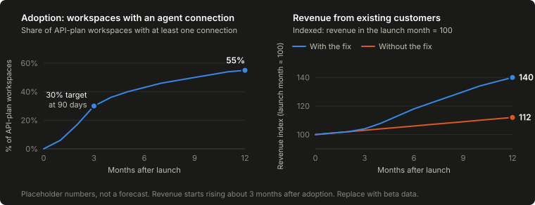

<!-- _class: lead -->

# External agents on Front

## A scoped, auditable way for third-party AI to read and act on Front

Developer Platform &middot; PRD walkthrough

---

### Why now

# Three trends outside Front

  

    
Scale

    
Gartner: agentic AI in 40% of enterprise apps by 2026, a third of all enterprise software by 2028.

  

  

    
Identity is unsolved

    
Non-human identities already outnumber human ones 17x to 80x+ in the enterprise, growing roughly 40% a year.

  

  

    
The real risk

    
40%+ of agentic AI projects get canceled by 2027 over unclear ROI or weak risk controls.

  

Gartner (2025); MCP one-year retrospective, Linux Foundation Agentic AI Foundation (2025); Veza 2026 State of Identity &amp; Access Report.

---

### The problem

# Agents borrow a teammate's identity, not their own

  

    
What exists

    
OAuth-based access with real read, write, and send scopes at the tool level.

  

  

    
What's missing

    
An identity for the agent itself, distinct from the teammate it's impersonating.

  

Every connection today authenticates as a specific teammate and inherits that person's exact permissions. There's no admin-managed way to grant an agent its own narrower, revocable access, and any activity record shows the teammate, not whether the agent or the person actually acted.

---

### Inputs and data points

# What I'd look at first

<table style="margin-top: 12px;">
<tr><th>Input</th><th>Metric tracked</th><th>Data source</th></tr>
<tr><td><strong>MCP beta usage</strong></td><td>Calls by tool; scope mix; denial and error rate</td><td>MCP server logs, API gateway</td></tr>
<tr><td><strong>Size of the "growing priority"</strong></td><td>Agent-connection requests per quarter</td><td>Support tickets, CRM, partner inbound</td></tr>
<tr><td><strong>Support rep baseline</strong></td><td>First-response time; conversations per rep per day</td><td>Front's own analytics</td></tr>
<tr><td><strong>Security precedent</strong></td><td>Non-human identities today, and how each is scoped and revoked</td><td>Auth service inventory, security team</td></tr>
<tr><td><strong>Interviews</strong></td><td>Top jobs and blockers (8-10 interviews)</td><td>Customer success, partner managers</td></tr>
<tr><td><strong>DPA coverage</strong></td><td>Share of contracts covering an agent; days to clear</td><td>Legal contract repository</td></tr>
</table>

---

### Who this is for

# Three jobs, one platform decision

  

    
Customer (Instructure)

    
When conversation volume outgrows headcount, let an agent triage and draft in my workspace, so I hold response times without hiring.

  

  

    
Partner (Aircall)

    
When I build a Front integration, use one scope model any admin can grant, so I ship once instead of adapting per customer.

  

  

    
Third-party client (Claude Desktop)

    
When a user points me at any Front workspace, connect the same way every time, so I need no bespoke integration per customer.

  

Real, public examples: a Front customer story, a named Front Integration Partner, and a generic MCP client that needs no partnership to connect at all.

---

### Highest-leverage use cases

# Read, draft, triage, trigger

<table style="margin-top: 12px;">
<tr><th>Use case</th><th>Risk</th><th>Why it matters</th></tr>
<tr><td><strong>Read context</strong></td><td>Low</td><td>The on-ramp for everything else the agent does</td></tr>
<tr><td><strong>Draft a reply</strong></td><td>Low, human sends</td><td>Highest leverage per unit of risk</td></tr>
<tr><td><strong>Triage / classify</strong></td><td>Medium, recoverable</td><td>Value compounds at volume</td></tr>
<tr><td><strong>Trigger a defined workflow</strong></td><td>Medium, scoped</td><td>Reuses automation Front already trusts</td></tr>
</table>

---

### MVP

# What ships first

  

    

    <strong>Agent connection</strong> as a named, scoped principal, not a generic token 
    <strong>MCP tools</strong> gated by connection scope, not an impersonated role 
    <strong>Human-in-the-loop send</strong>, a structural gate, not a UI convention
    

  

  

    

    <strong>Audit log</strong> of every scoped action: connection, scope, target, time 
    <strong>One-click revocation</strong>, effective immediately 
    No autonomous send, no self-expanding scopes, no marketplace, in v1
    

  

---

### Roadmap

# Draft-and-approve first, autonomy earned later

<table style="margin-top: 16px;">
<tr><th>Phase</th><th>Duration</th><th>Scope</th></tr>
<tr><td><strong>0</strong></td><td>1-2 wks</td><td>Scope taxonomy and data model with security and infra</td></tr>
<tr><td><strong>1</strong></td><td>4-6 wks</td><td>Connect/consent UI, audit log, read + draft tools. Closed beta.</td></tr>
<tr><td><strong>2</strong></td><td>3-4 wks</td><td>Tag/assign and workflow-trigger tools. Open beta, self-serve.</td></tr>
<tr><td><strong>3</strong></td><td>GA</td><td>Decide v1.1 auto-send opt-in on measured trust, not a date</td></tr>
</table>

---

### Risks

# What could go wrong, and the mitigation

<table style="margin-top: 12px;">
<tr><th>Risk</th><th>Mitigation</th></tr>
<tr><td><strong>A scoped agent is still a meaningful blast radius</strong></td><td>Team/inbox-level default scopes, per-connection rate limits</td></tr>
<tr><td><strong>Support reps ignore drafts, adoption stalls</strong></td><td>Measure edit-distance and send-rate in beta; make accept faster than writing</td></tr>
<tr><td><strong>MCP auth patterns still stabilizing industry-wide</strong></td><td>Version the server interface from day one, track the spec's auth working group</td></tr>
<tr><td><strong>DPAs may not contemplate a third-party agent</strong></td><td>Legal and compliance in Phase 0; developer data-handling attestation</td></tr>
</table>

---

### Out of scope, and non-goals

# What's deferred, and what's permanent

  

    
Not now (deferred)

    

    Autonomous send 
    Partner marketplace or directory 
    SDKs beyond raw MCP tool calls
    

  

  

    
Not ever (non-goals)

    

    Self-expanding scopes 
    Cross-workspace or cross-tenant access 
    A non-MCP transport
    

  

Each deferred item has a real revisit trigger tied to beta data, not a fixed date. Non-goals would undermine the safety model itself, not just add scope to it.

---

### Success metrics

# Four, matching the brief's own categories

  

    
Adoption

    
30% of API-plan workspaces create a connection within 90 days of GA.

  

  

    
Time to first integration

    
Median under 30 minutes, credentials to first sandbox tool call.

  

  

    
Developer satisfaction

    
8/10+ on scope-model clarity in the post-beta survey.

  

  

    
Reliability

    
99.9% MCP server availability, P95 tool-call latency under 500ms.

  

---

### Business impact

# Adoption first, revenue later

<strong>Hypothesis:</strong> customers that connect an agent handle more conversations per Support rep, so they buy more seats and make more API calls. Their spending rises about 3 months after they connect, so the revenue line climbs after the adoption line. An index of 140 means 40% more revenue than in the launch month. All numbers are placeholders until beta data replaces them.

---

### How it communicates

# MCP as the door, not a new house

  

    
External agent

    
&rarr; MCP tool call &rarr;

    
Front MCP server scope check

    
&rarr;

    
Front's internal services same path the UI uses

  

Writes go through the same command/event pipeline Front already uses for its own automation. Nothing new at the domain level, only a new, scoped entry point into it. <strong>SendReply</strong> is the one command no agent credential can ever reach, see the event model.

---

### Technical implementation

# Three trust zones, one path

<svg viewBox="0 0 1160 380" style="width: 100%; height: auto; display: block; max-height: 380px;">
  <defs>
    <marker id="arrow" viewBox="0 0 10 10" refX="8" refY="5" markerWidth="6.5" markerHeight="6.5" orient="auto-start-reverse">
      <path d="M0,0 L10,5 L0,10 z" fill="#666"/>
    </marker>
    <symbol id="icon-monitor" viewBox="0 0 24 24"><g fill="none" stroke="currentColor" stroke-width="1.8" stroke-linecap="round" stroke-linejoin="round"><rect x="3" y="4" width="18" height="12" rx="1.5"/><line x1="8" y1="20" x2="16" y2="20"/><line x1="12" y1="16" x2="12" y2="20"/></g></symbol>
    <symbol id="icon-lock" viewBox="0 0 24 24"><g fill="none" stroke="currentColor" stroke-width="1.8" stroke-linecap="round" stroke-linejoin="round"><rect x="5" y="11" width="14" height="9" rx="2"/><path d="M8 11V7a4 4 0 0 1 8 0v4"/></g></symbol>
    <symbol id="icon-db" viewBox="0 0 24 24"><g fill="none" stroke="currentColor" stroke-width="1.8" stroke-linecap="round" stroke-linejoin="round"><ellipse cx="12" cy="5" rx="8" ry="3"/><path d="M4 5v14c0 1.66 3.58 3 8 3s8-1.34 8-3V5"/><path d="M4 12c0 1.66 3.58 3 8 3s8-1.34 8-3"/></g></symbol>
    <symbol id="icon-gauge" viewBox="0 0 24 24"><g fill="none" stroke="currentColor" stroke-width="1.8" stroke-linecap="round" stroke-linejoin="round"><circle cx="12" cy="12" r="8.5"/><line x1="12" y1="12" x2="15.5" y2="8"/><circle cx="12" cy="12" r="1.1" fill="currentColor" stroke="none"/></g></symbol>
    <symbol id="icon-server" viewBox="0 0 24 24"><g fill="none" stroke="currentColor" stroke-width="1.8" stroke-linecap="round" stroke-linejoin="round"><rect x="4" y="4" width="16" height="6" rx="1.2"/><rect x="4" y="14" width="16" height="6" rx="1.2"/><circle cx="7.3" cy="7" r="0.9" fill="currentColor" stroke="none"/><circle cx="7.3" cy="17" r="0.9" fill="currentColor" stroke="none"/></g></symbol>
  </defs>

  <!-- Outside Front -->
  <rect x="20" y="65" width="190" height="230" rx="8" fill="none" stroke="#555" stroke-width="2"/>
  <text x="32" y="88" font-size="12" font-weight="600" letter-spacing="1" fill="#888">OUTSIDE FRONT</text>
  <use href="#icon-monitor" x="95" y="88" width="40" height="40" style="color:#999"/>
  <text x="115" y="148" font-size="13" font-weight="600" fill="#ddd" text-anchor="middle">External agents</text>
  <text x="115" y="172" font-size="11" fill="#999" text-anchor="middle">Customer-built copilot</text>
  <text x="115" y="192" font-size="11" fill="#999" text-anchor="middle">Partner integration</text>
  <text x="115" y="212" font-size="11" fill="#999" text-anchor="middle">Third-party MCP client</text>

  <!-- Network hop -->
  <line x1="215" y1="180" x2="378" y2="180" stroke="#666" stroke-width="2" marker-start="url(#arrow)" marker-end="url(#arrow)"/>
  <text x="296" y="164" font-size="12" fill="#888" text-anchor="middle">MCP over TLS</text>
  <text x="296" y="198" font-size="9.5" letter-spacing="1" fill="#555" text-anchor="middle">INTERNET</text>

  <!-- Front boundary -->
  <rect x="400" y="10" width="740" height="340" rx="8" fill="none" stroke="#4f8df9" stroke-width="2.2"/>
  <text x="414" y="32" font-size="14" font-weight="700" letter-spacing="1" fill="#4f8df9">FRONT</text>

  <!-- Public MCP edge -->
  <rect x="424" y="50" width="692" height="130" rx="6" fill="#4f8df9" fill-opacity="0.05" stroke="#4f8df9" stroke-width="1.5" stroke-dasharray="6,4"/>
  <text x="438" y="68" font-size="12" font-weight="600" letter-spacing="0.5" fill="#4f8df9">PUBLIC MCP EDGE &middot; NEW</text>

  <rect x="444" y="82" width="210" height="88" rx="6" fill="#0a0a0a" stroke="#333"/>
  <use href="#icon-lock" x="535" y="90" width="28" height="28" style="color:#4f8df9"/>
  <text x="549" y="136" font-size="12" font-weight="600" fill="#eee" text-anchor="middle">OAuth 2.1 + PKCE</text>
  <text x="549" y="154" font-size="9.5" fill="#888" text-anchor="middle">Short-lived, token exchange</text>

  <rect x="666" y="82" width="222" height="88" rx="6" fill="#0a0a0a" stroke="#333"/>
  <use href="#icon-db" x="763" y="90" width="28" height="28" style="color:#4f8df9"/>
  <text x="777" y="130" font-size="12" font-weight="600" fill="#eee" text-anchor="middle">Connection &amp;</text>
  <text x="777" y="145" font-size="12" font-weight="600" fill="#eee" text-anchor="middle">Scope Store</text>
  <text x="777" y="163" font-size="9.5" fill="#888" text-anchor="middle">Scope checked every call</text>

  <rect x="900" y="82" width="200" height="88" rx="6" fill="#0a0a0a" stroke="#333"/>
  <use href="#icon-gauge" x="986" y="90" width="28" height="28" style="color:#4f8df9"/>
  <text x="1000" y="136" font-size="12" font-weight="600" fill="#eee" text-anchor="middle">Rate Limiter</text>
  <text x="1000" y="154" font-size="9.5" fill="#888" text-anchor="middle">Per connection</text>

  <!-- Down arrow into internal platform -->
  <line x1="770" y1="180" x2="770" y2="196" stroke="#666" stroke-width="2" marker-end="url(#arrow)"/>
  <text x="792" y="192" font-size="10" fill="#666">in-scope calls only</text>

  <!-- Internal platform -->
  <rect x="424" y="196" width="692" height="130" rx="6" fill="#22c55e" fill-opacity="0.05" stroke="#22c55e" stroke-width="1.5" stroke-dasharray="6,4"/>
  <text x="438" y="214" font-size="12" font-weight="600" letter-spacing="0.5" fill="#22c55e">INTERNAL PLATFORM &middot; EXISTING</text>

  <rect x="444" y="228" width="350" height="88" rx="6" fill="#0a0a0a" stroke="#333"/>
  <use href="#icon-server" x="605" y="236" width="28" height="28" style="color:#22c55e"/>
  <text x="619" y="282" font-size="12" font-weight="600" fill="#eee" text-anchor="middle">Conversation &amp; Workflow Services</text>
  <text x="619" y="300" font-size="9.5" fill="#888" text-anchor="middle">Same path Front's UI already uses</text>

  <rect x="814" y="228" width="286" height="88" rx="6" fill="#0a0a0a" stroke="#333"/>
  <use href="#icon-db" x="943" y="236" width="28" height="28" style="color:#22c55e"/>
  <text x="957" y="282" font-size="12" font-weight="600" fill="#eee" text-anchor="middle">Audit Log Store</text>
  <text x="957" y="300" font-size="9.5" fill="#888" text-anchor="middle">Connection, action, target, time</text>
</svg>

The Connection &amp; Scope Store, rate limiter, and audit log are the genuinely new pieces. Everything inside the internal platform boundary already runs today, and <strong>SendReply</strong> there is issued by a Support rep, never by an agent credential.

---

### Access pattern

# Every scoped call, the same six steps

<table style="margin-top: 8px;">
<tr><th>Step</th><th>Control</th></tr>
<tr><td><strong>Agent calls an MCP tool over TLS</strong></td><td>Short-lived, token-exchange credential, not a long-lived key</td></tr>
<tr><td><strong>Edge looks up the connection's stored scopes</strong></td><td>Server-side only; the caller's claim is never trusted</td></tr>
<tr><td><strong>Scope check gates the call</strong></td><td>Zero tolerance for scope escapes; denials are logged too</td></tr>
<tr><td><strong>In-scope call reaches Front's existing service</strong></td><td>No second execution path to maintain or drift from</td></tr>
<tr><td><strong>Service performs the action under its own rules</strong></td><td>e.g. draft only, a workflow already approved</td></tr>
<tr><td><strong>Every outcome writes one audit entry</strong></td><td>Connection, action, target, time; retained 1+ year</td></tr>
</table>

P95 latency: under 500ms read, under 800ms write. Rate limits by tier: roughly 120/30/20 calls per minute. Revocation reaches every future call in under a minute.

---

### Technical trade-offs

# What I'd work through with engineering

<strong>Coupling vs. gateway</strong>: fast to ship vs. safe to evolve independently 
<strong>Sync vs. async tool calls</strong>: simple today vs. what long-running actions need 
<strong>Fine-grained vs. bundled scopes</strong>: least privilege vs. easy to reason about 
<strong>Per-connection vs. per-workspace rate limits</strong>: predictable vs. infra-safe

---

<!-- _class: lead -->

### The hardest assumption

# Human review is enough to de-risk launch

If customers push for auto-send in week one because draft-and-approve doesn't save enough time, the fix is that the permission and audit layer, the actual safety mechanism, was already built robust enough to support it. Extending to v1.1 becomes a scope change, not a re-architecture.

